# Final Project
**Name:** Medvegy Gábor 

**Neptun:** SZHNB1

# 

# 1: Creating buckets and uploading data:

# 

# 1.1: Creating the S3 buckets for the raw data and the transformed data

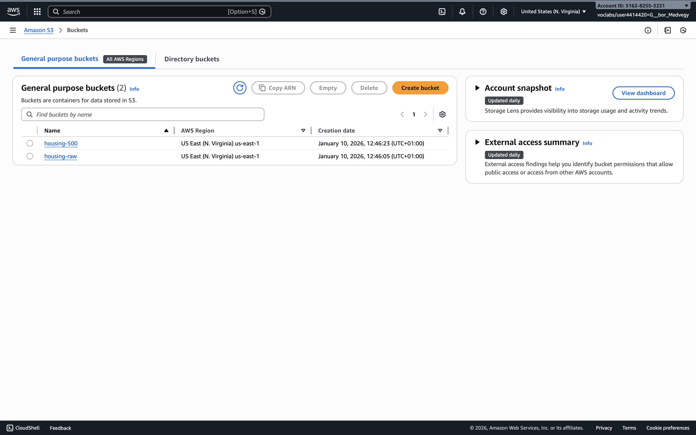


## 1.2: Creating the Cloud9 development environment

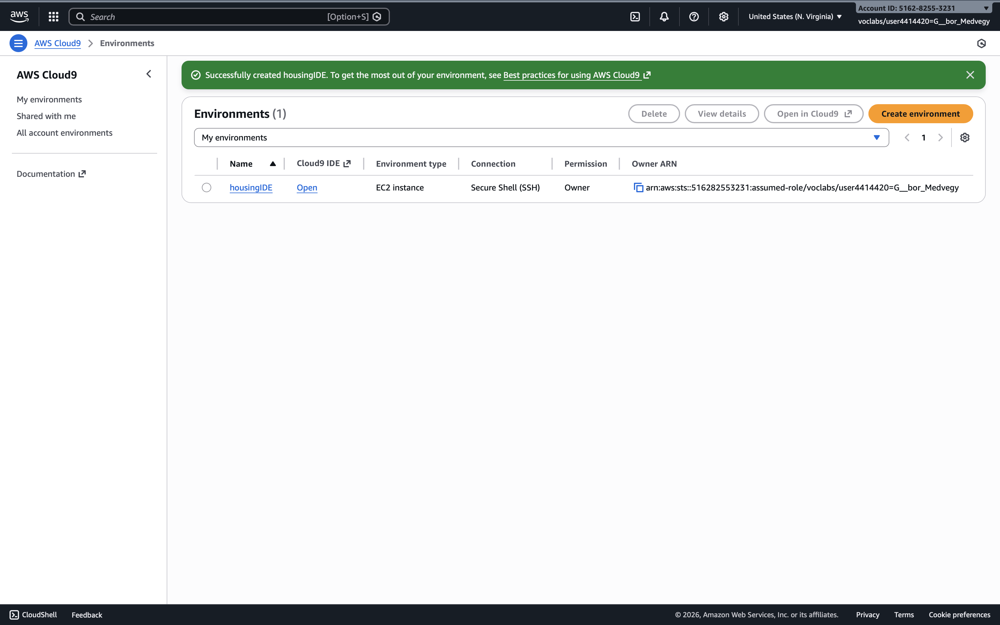

## 1.3: Uploading the raw data file into its designated bucket:

**Terminal command used in Cloud9 IDE:**

```bash
aws s3 cp california_housing.csv s3://housing-raw/
```

**To verify the upload, I ran the the following command --> file was displaye:**

```bash
aws s3 ls s3://housing-raw/
```

##


# 2: Creating the ETL pipeline using AWS Lambda and Cloud9:

##

## 2.1: Docker

Docker was used to package the ETL application together with all required Python libraries (such as pandas and NumPy) into a single, self-contained container image. The application was organized in an etl_lambda directory, containing the lambda_function.py source file, a requirements.txt file specifying all Python dependencies, and a Dockerfile defining the build process for the container image. This approach was necessary because AWS Lambda’s default runtime environment does not include these dependencies and has strict system limitations. By building the Docker image locally and pushing it to Amazon ECR, the exact same execution environment could be reliably deployed and executed in AWS Lambda without dependency conflicts, ensuring portability, reproducibility, and consistency between local development and cloud execution.

## 2.2: Build Lambda container image

```bash
docker buildx build --platform linux/amd64 -t etl-function:latest --load .
```

## 2.3: Zip and Unzip Lambda source for Cloud9

```bash
zip -r etl_lambda.zip etl_lambda
```

```bash
unzip -o etl_lambda.zip
cd etl_lambda
```

Output:

```bash
Dockerfile
requirements.txt
lambda_function.py
```

## 2.4: Build Docker image in Cloud9 

```bash
docker build -t etl-function:latest .
```

## 2.5: Amazon ECR setup:

```bash
aws ecr describe-repositories --repository-names etl-function --region us-east-1 \
|| aws ecr create-repository --repository-name etl-function --region us-east-1
```

## 2.6: Authenticate Docker to ECR

```bash
aws ecr get-login-password --region us-east-1 \
| docker login --username AWS --password-stdin 516282553231.dkr.ecr.us-east-1.amazonaws.com
```

The 516282553231 is the AWS account ID.


## 2.7: Tag and push Docker image to ECR

```bash
docker tag etl-function:latest \
516282553231.dkr.ecr.us-east-1.amazonaws.com/etl-function:latest
```

```bash
docker push 516282553231.dkr.ecr.us-east-1.amazonaws.com/etl-function:latest
```

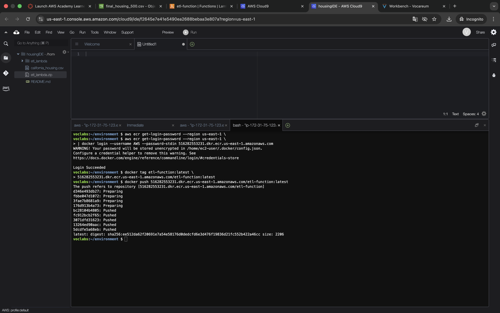

It was indeed successful.

## 

**Summary:**

In these steps, the ETL application was first containerized by building a Docker image that includes the Lambda function code and all required dependencies. The source files were transferred to the Cloud9 environment, where the image was rebuilt to ensure compatibility with AWS infrastructure. An Amazon ECR repository was then created to store the container image, Docker was authenticated against ECR using the AWS account ID, and the image was tagged and pushed to the repository. This made the container image available for deployment as an AWS Lambda function.

## 


# 3: Configuring the AWS Lambda function

## 

The previously built Docker container image stored in Amazon ECR was used to create an AWS Lambda function. The Lambda was configured to run the ETL logic contained in the container, ensuring that the same execution environment used during development was preserved in production.

During configuration, the function’s memory was increased to 1024 MB and ephemeral storage was increased to 1024 MB to ensure sufficient resources for data processing, temporary file storage, and dependency usage (such as pandas and request caching). The timeout was extended to 15 minutes because the ETL process includes multiple external API calls, which are subject to rate limits and can significantly slow down execution. These adjustments ensured that the function could complete reliably without premature termination.

## 3.1: Creating and configuring the AWS Lambda function:

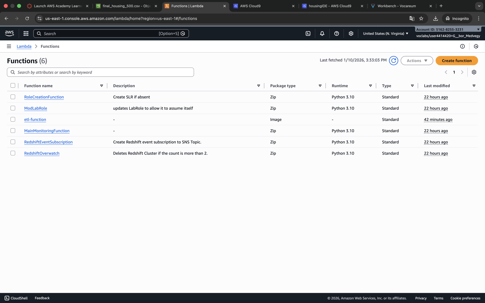

## 

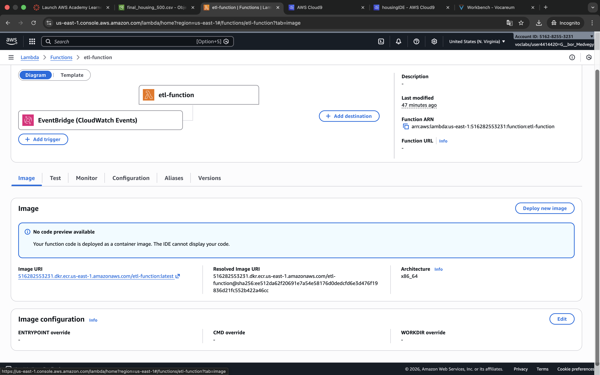

##

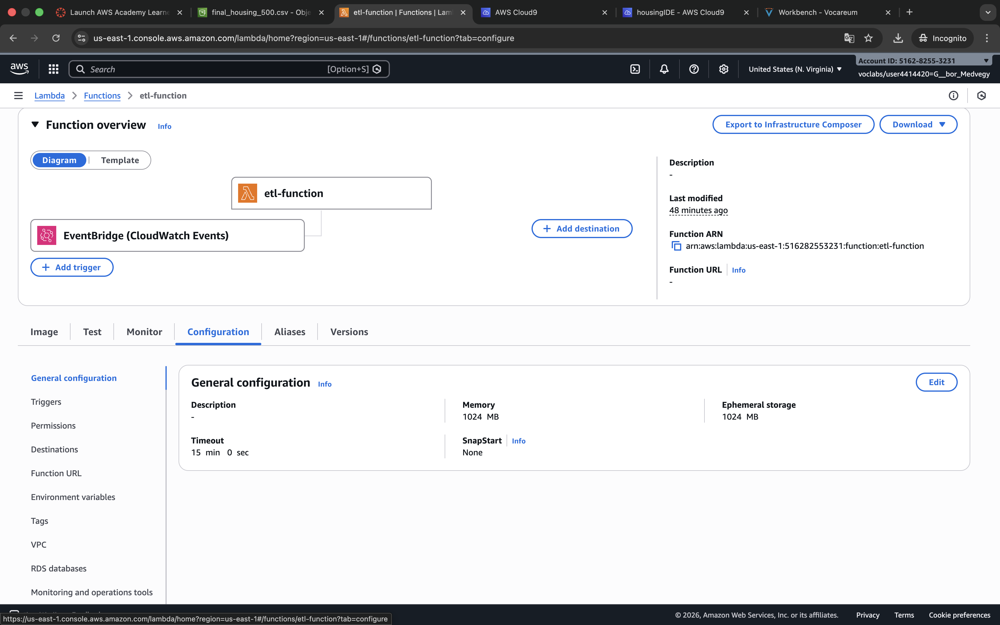


## 3.2: Trigger:

An Amazon EventBridge schedule trigger was attached to the Lambda function to automate execution. The trigger defines when the ETL pipeline runs (here once per day) and automatically starts the Lambda function according to the configured schedule. Each time the rule fires, the Lambda function executes the complete ETL pipeline: it reads the input housing data from Amazon S3, enriches the data with historical weather information retrieved from the API, and writes the transformed output back to S3.
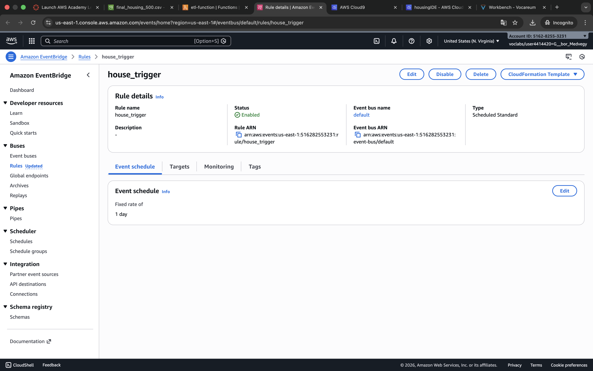

##

# 4. Test and Deployment:

##

After configuration, the Lambda function was manually tested using the AWS Lambda Test feature to verify correct execution before relying on the scheduled trigger. The test results confirmed that the function ran successfully, processed the data as expected, and produced the output file in the designated S3 bucket.

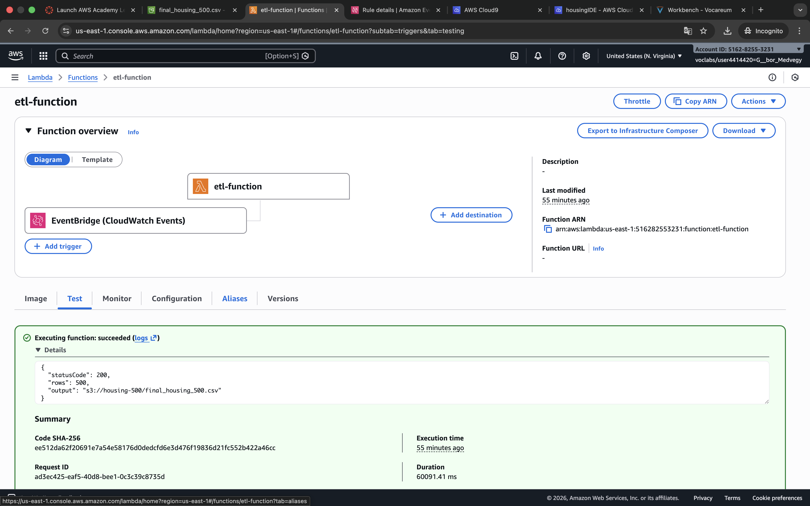

##

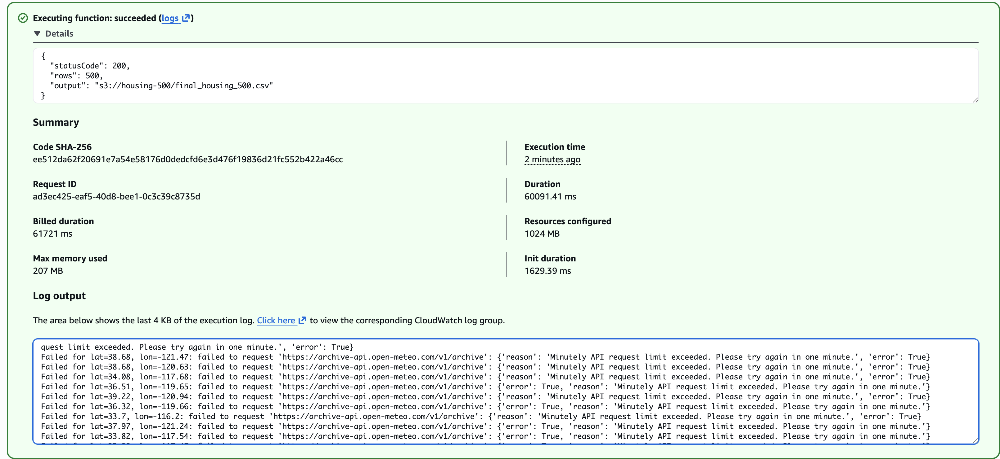

It was successfully deployed. (Note: some coordinate pairs are not retrieved because of the API's limitation (monetary issue))

##

**Summary:**
Using the features of AWS Lambda the data was transformed and and moved fro the source bucket to the destination bucket.The Lambda function implements a complete Extract–Transform–Load (ETL) pipeline. During the Extract phase, the function downloads the California housing dataset from the source Amazon S3 bucket and loads it into a pandas DataFrame. In the Transform phase, missing values in the total_bedrooms variable are imputed using the median, numerical outliers are identified and capped using the interquartile range (IQR) method, and a stratified random sample of 500 observations is created based on the ocean_proximity category (this is because the API's daily request limitation). For each unique latitude–longitude pair in the sample, historical daily weather data (average temperature, total sunshine duration, and total precipitation) is retrieved from the Open-Meteo API, aggregated to yearly values, and merged back into the original housing dataset. In the Load phase, the resulting dataset is exported as a CSV file and uploaded to destionation Amazon S3 bucket.

## 


# 5. Creating AWS Glue Database and its crawler:

##

## 5.1 Creating the database

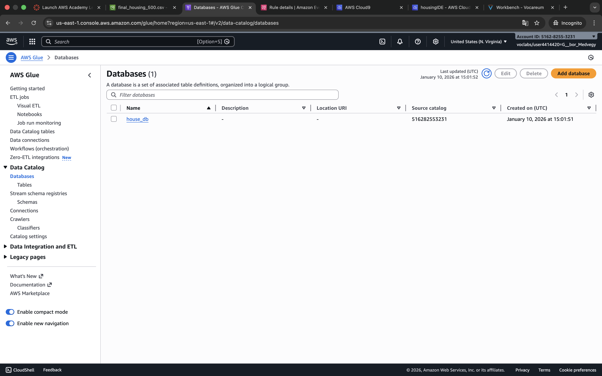

##

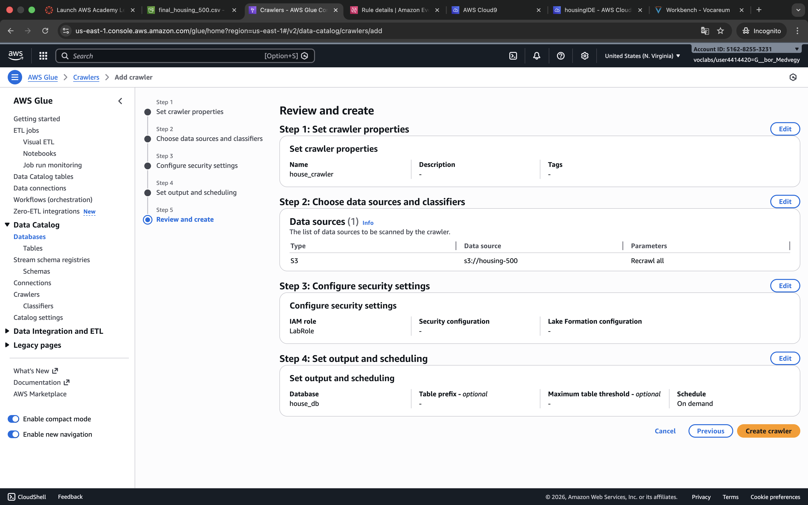

##

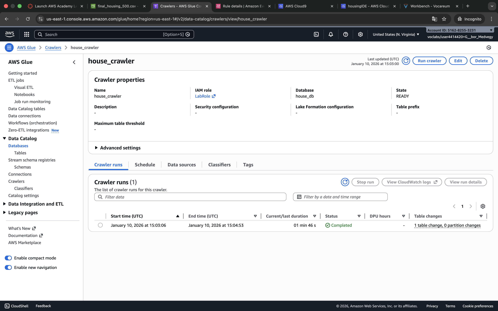

##

**Summary:**

An AWS Glue database was created to catalog the transformed dataset stored in the destination bucket. A Glue crawler was configured to scan the destination bucket, automatically use the schema of the processed CSV file, and create a corresponding table within the Glue Data Catalog. This enables the transformed housing dataset to be easily queried with analytical services such as Amazon Athena without requiring manual schema definition.

##

# 6: Querying the data using Amazon Athena:

##

Some exploratory queries were also run in Amazon Athena to demonstrate that the transformed dataset can be used for analysis. However, performing an in-depth analysis was not the main focus of this project, which primarily aimed to build and automate a robust ETL pipeline, but the data produced allows such analyses to be carried out if needed.


## 6.1: Test Query

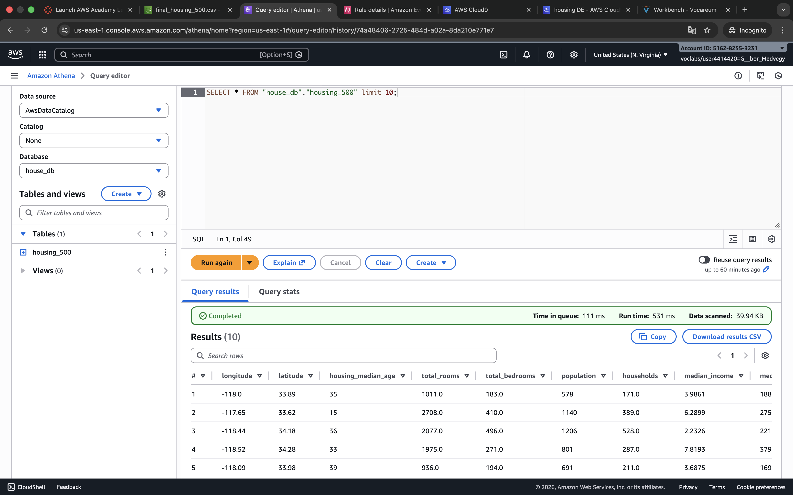

It runs.

##

## 6.2: Average house value by ocean proximity:

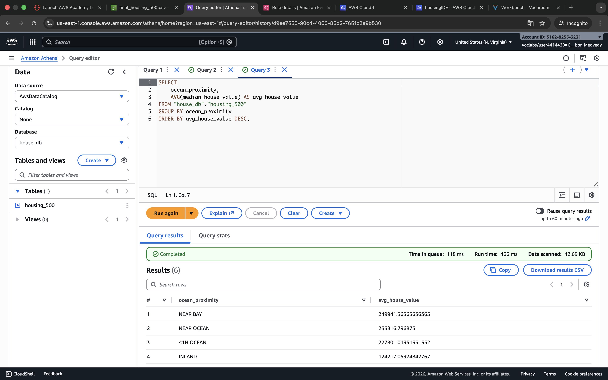

Average house value by ocean proximity. Near ocean --> More expensive.

## 6.3: Income vs house value by ocean proximity:

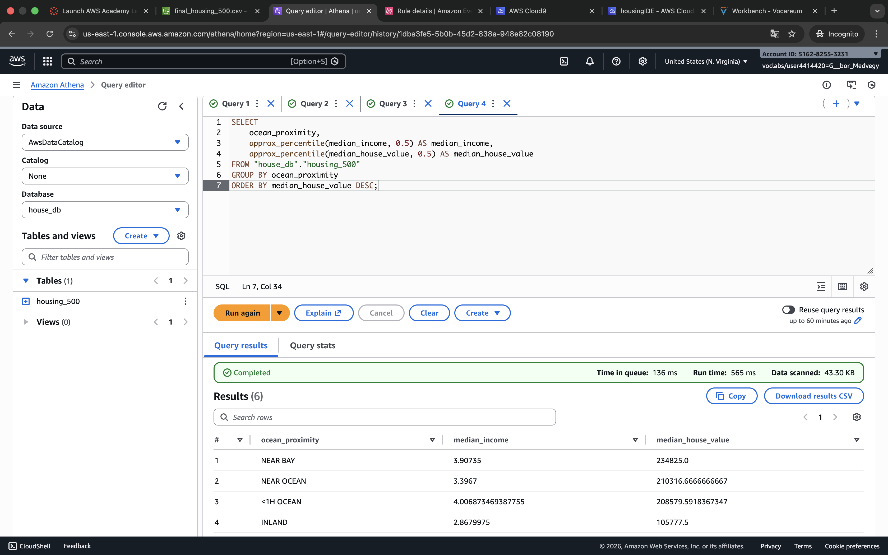

Income vs house value by ocean proximity. Confirms the relationship between income and house value. Higher income --> higher house value.

##


## 6.4: Price-to-income ratio:

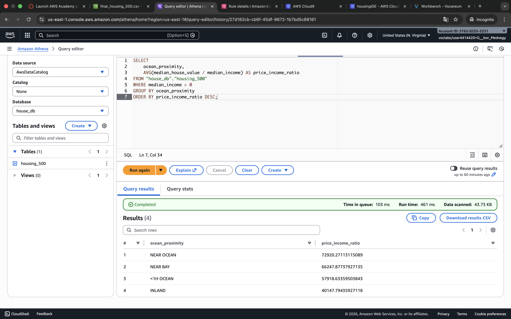

Price-to-income ratio. Higher value means that housing is expensive relative to residents’ income. (Higher prices near ocean here.)

##


# 7. The Final Architecture:

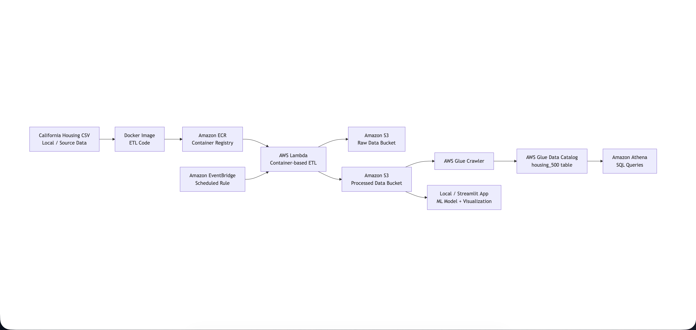